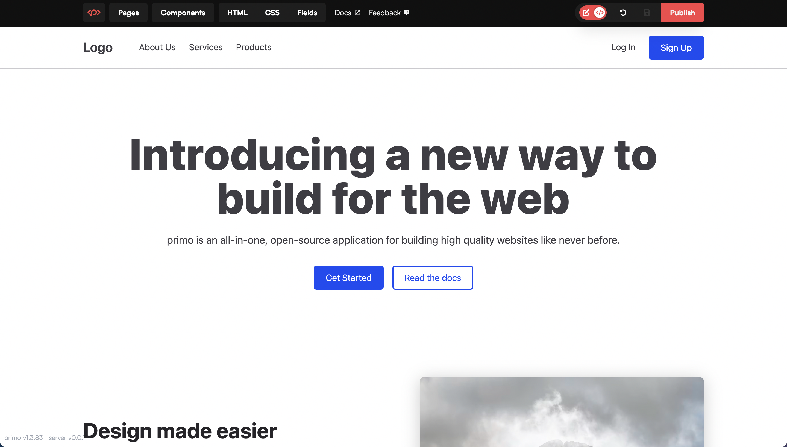

# Primo Server
Primo is an all-in-one CMS that makes it easier to develop, manage, and publish static sites. This project hosts Primo as a SvelteKit application and integrates it with [Supabase](https://supabase.com) to enable authentication, media uploads, and data storage. A single Primo server can handle hundreds of sites, publishes static sites to their own repos/endpoints, and enables rapid component-driven development. 

This is a base repository for Primo Server that you can fork to host your own Server. All you need is a Supabase and Vercel account (both free & can be logged in with Github), and a few minutes to put up your Server from which you can create and manage one to hundreds of sites. Compared to Primo Desktop, Primo Server enables you to access your sites online, collaborate with developers and marketers, and upload images. You can also access your Server sites from your desktop. 

### Features
* Multiple users
* Image uploads
* Use from anywhere

## Project Status
Primo Server is in late Alpha. Features may break from version to version, but likely not enough to cause loss of data. Until we ge to Beta, we can't recommend using Primo in production, but it's stable enough for personal projects.

## How it works
This repo deploys primo to [Vercel](https://vercel.com) and uses [Supabase](https://supabase.co) for authentication, database (PostgreSQL), and storage. 

## Setup 
Primo can be run on the free tier of both services (Vercel & Supabase), and you can sign in with Github.

Before deploying your Primo Server, you'll need to sign up for [Supabase](https://supabase.co) and create a new project. 

### 1. Fork this repository

### 2. Deploy Backend (Supabase)
1. Create a [Supabase](https://supabase.co) account or sign in with Github
1. Create a new project
1. When it's ready, select 'SQL' from the sidebar navigation
1. Click **+ New query** 
1. Paste in the contents of [`./primo_schema.sql`](https://raw.githubusercontent.com/primo-af/primo-server/master/primo_schema.sql) and click 'RUN' 

### 3. Deploy Frontend (Vercel)

1. Start a new Vercel project
1. Select your forked repository
1. For the environment variables, enter your Supabase project **URL**, **Public Key (anon public)**, and **Admin Key (service_role secret)** (which you can find in the Supabase project dashboard > Settings > API https://app.supabase.io/project/---yourprojectid---/settings/api)
1. Click 'Deploy'
1. Navigate to your new Primo Server. Sign up with an email address and password (this will be the admin account). 

### Updating

You can merge upstream updates by clicking 'Sync fork' on your forked repository. Your updates will automatically deploy to your Vercel account. 
